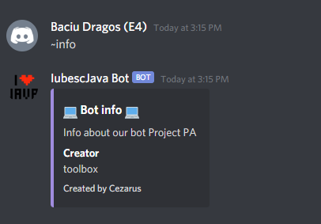
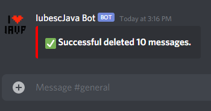
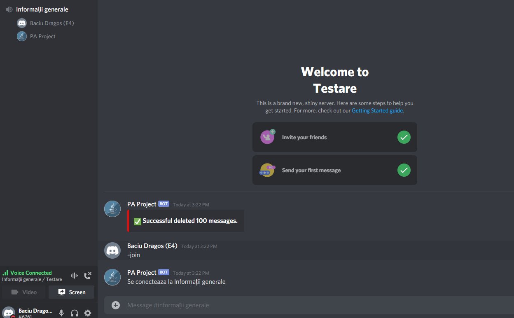
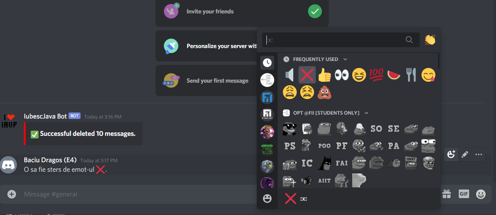
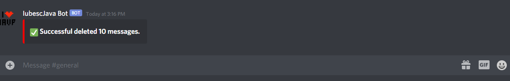
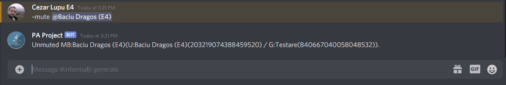
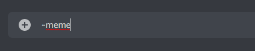
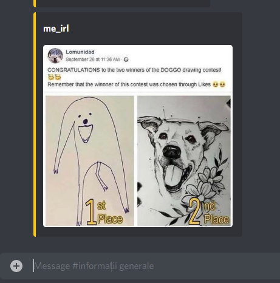

# ProiectPA
Lupu Cezar-Justinian / Baciu Dragos
-
Proiect: Bot de discord
Limbaj de programare folosit: Java

-DESCRIERE-
<ul>
  Motivație:
  <li>
    Ne-am ales ca tema pentru proiectul de la AP sa realizăm un bot de discord. Folosind zi de zi Discord-ul in cadrul facultații ne-am hotărât că ar fi o idee buna dacă am face ceva care să ne folosească și pe viitor.
  </li>
</ul>
<ul>
  Tehnologii:
  <li> JDA - ne pune la dispozitie un mod de a ne conecta la bot</li>
  <li> botCommons - ne ajuta la modelarea mai usoara a event-urilor</li>
  <li> json-simple - ne permite citirea si parsarea unui json dat ca parametru</li>
  <li> lavaplayer - ajuta foarte mult la realizarea unei comenzi de play</li>
</ul>
<ul>
  Funcționalități:
  <li>
    Comanda Info -> într-un canal de text comanda '~info' arată detaliile proiectului.  
    
  </li>
  <li>
    Comanda Clear -> într-un canal de text comanda '~clear {number}', unde *number* este un numar nenul, sterge *number* linii din canalul de text unde a fost apelată comanda.  
      
    
  </li>
  <li>
    Comanda Join -> intr-un canal de text comanda '~join' aduce bot-ul intr-un canal de voce daca membrul apelant se află într-un canal de voce.  
    
  </li>
  <li>
    Comanda Leave -> într-un canal de text comanda '~leave' deconectetază bot-ul de la un canal de voce dacă apelantul este în aceeași cameră cu bot-ul. 
    
  </li>
  <li>
    Comanda Delete -> Dacă se dorește ștergerea unui comentariu dintr-un canal de text membrul dispune de emote-ul :x:. Acest emote lipit de un comentariu îl face să dispară. 
     
    
  </li>
  <li>
    Comanda Mute -> într-un canal de text comanda '-mute {membru}' îi interzice membrului *membru* să mai poată să scrie în orice canal de text. 
      
    
  </li>
  <li>
    Comanda Meme -> într-un canal de text comanda '~meme' afișează meme-uri random.  
      
    
  </li>
</ul>

